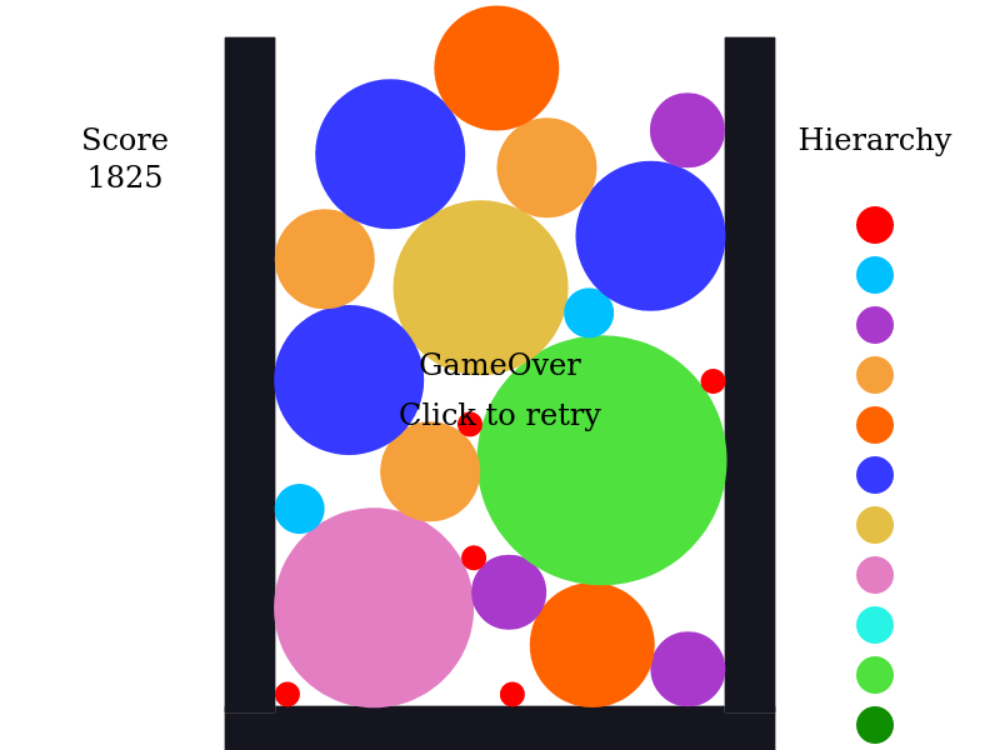

<link rel="stylesheet" type="text/css" href="style.css" />

# スイカゲームくらい自給自足すっか
### あいさつ
こんにちは, kmcid: taisei です.
この記事は KMC Advent Calendar 2023 の 2 日目の記事です.

昨日の記事は segre さんによる
[kubeadm+flannelでkubernetesクラスタのIPv6環境構築](https://qiita.com/segre5458/items/3d6bf9a10b83ddedfa1b) でした.

<!-- Reference: https://mbdb.jp/web-technical/hatenablog-blogcard-ogp-correspondence.html -->
<iframe style="width:100%;height:155px;max-width:100%;margin:0 0 1.7rem;display:block;" title="kubeadm+flannelでkubernetesクラスタのIPv6環境構築" src="https://hatenablog.com/embed?url=https://qiita.com/segre5458/items/3d6bf9a10b83ddedfa1b" width="300" height="150" frameborder="0" scrolling="no"></iframe>

もう 12 月に入りましたが, 京都ではまだまだ紅葉が見頃の場所が結構あります.
先日行った京都の大原野はそこそこ僻地で行くのが大変でしたが,
なかなか見事でした.


北の山の方は落ちてるらしいですが,
麓の方は今週末までくらいはまだまだ行けると思うので是非足を運んでみてください.

### 概要
さて本記事に話を戻します.
なんか巷でスイカゲームなるものが流行っているらしいですね.
見たところ, 物理エンジンを使ったパズルゲームで,
同じ大きさの果物をくっつけて大きくして,
一番大きい果物のスイカを作るのが一つの目標のゲームらしいです.

これくらいだったら自給自足すればいいかと思い,
**[スイカゲームもどき](../index.md)** を作りました.
リンク先で動いています.



## つくりかた
スイカゲームを作るだけなら unity でホイってするのが多分一番楽なんでしょうけれど,
今回は jsoo を使って実装しました[^jsoo-relation].

### Jsoo とは
`js_of_ocaml` というトランスパイラのことです.
ocaml から javascript を生成することができます.
<https://ocsigen.org/js_of_ocaml/latest/manual/overview>

`ocamlc` でコンパイルして得たバイトコードを`js_of_ocaml` コマンドに食わせると js ファイルを生成してくれます.
もしくは ビルドシステムの `dune` であれば設定ファイルに `(modes js)` と一言設定を書くと,
`_build/default` (`dune` 使いにとっては例の場所)以下に js ファイルを生成してくれるようになります.


### js と組み合わせる
スイカゲームを作るには物理エンジンが欲しいので js の適当なライブラリを導入します.
今回は `matter-js` を使ってみました.
<https://github.com/liabru/matter-js#readme>


まずはサンプルを動かしてみます.
サンプルを公式から `main.ml` ファイルにこんな感じでコピペして
```ocaml
open Js_of_ocaml

let _ =
  Js.Unsafe.eval_string "
// module aliases
var Engine = Matter.Engine,
    Render = Matter.Render,
    Runner = Matter.Runner,
    Bodies = Matter.Bodies,
    Composite = Matter.Composite;

// create an engine
var engine = Engine.create();

// create a renderer
var render = Render.create({
    element: document.body,
    engine: engine
});

// create two boxes and a ground
var boxA = Bodies.rectangle(400, 200, 80, 80);
var boxB = Bodies.rectangle(450, 50, 80, 80);
var ground = Bodies.rectangle(400, 610, 810, 60, { isStatic: true });

// add all of the bodies to the world
Composite.add(engine.world, [boxA, boxB, ground]);

// run the renderer
Render.run(render);

// create runner
var runner = Runner.create();

// run the engine
Runner.run(runner, engine);
"
```

dune ファイルに設定を書いて
```dune
(executable
 (name main)
 (modes js)
 (preprocess (pps js_of_ocaml-ppx))
 (libraries js_of_ocaml))
```

html ファイルでライブラリと共に読み込むと動きます.
```html
<html>
  <body>
    <script type="text/javascript" src="./matter.min.js"></script>
    <script type="text/javascript" src="./_build/default/main.bc.js"></script>
  </body>
</html>
```

ディレクトリ構造はこんな感じです.
```
.
├── _build
│   └── default
│       └── main.bc.js
├── dune
├── dune-project
├── index.html
├── main.ml
└── matter.min.js
```


簡単ですね！

### js を ocaml っぽく移植する
まぁでもこれだけだとただ js を文字列で埋め込んでいるだけであまり嬉しくないので,
ocaml っぽくしていきます.

```ocaml
open Js_of_ocaml

(* module aliases *)
let _Matter = Js.Unsafe.pure_js_expr "Matter"
let _Engine = _Matter##.Engine
let _Render = _Matter##.Render
let _Runner = _Matter##.Runner
let _Bodies = _Matter##.Bodies
let _Composite = _Matter##.Composite

(* create an engine *)
let engine = _Engine##create ()

(* create a renderer *)
let render =
  _Render##create
    (object%js
       val element = Dom_html.document##.body
       val engine = engine
    end)

(* create two boxes and a ground *)
let boxA = _Bodies##rectangle 400 200 80 80
let boxB = _Bodies##rectangle 450 50 80 80
let ground =
  _Bodies##rectangle
    400
    610
    810
    60
    (object%js
       val isStatic = true
    end)

(* create runner *)
let runner = _Runner##create ()

let () =
  (* add all of the bodies to the world *)
  _Composite##add engine##.world (Js.array [| boxA; boxB; ground |]) ;

  (* run the renderer *)
  _Render##run render ;

  (* run the engine *)
  _Runner##run runner engine
```

- `##`, `##.`, `object%js` は ocaml のプリプロセッサ(ppx)による拡張です.
プロパティアクセスが `##.`, メソッド呼び出しは `##` で, `object%js` はオブジェクトリテラルです.

- js と ocaml ではいくつか基本型の内部表現が異なるため,
  js の値を ocaml で表現する場合は js 用の値を使う場合があります.
  `bool`, `string`, `array` がそうで, それぞれ `bool Js.t`, `Js.js_string`, `Js.js_array Js.t` へ変換する必要があります.
  - 上のコードだと `Js.array [| boxA; boxB; ground |]` が, ocaml の `array` から `Js.js_array Js.t` への変換をしている箇所です

構造的な見た目は大きく変えないままで js のコードを ocaml へ移植できているのではないでしょうか.

### ゲームを実装する

jsoo はただ js を ocaml っぽく書けるというだけではなくて,
ocaml の object の型付けによる恩恵を受けることができます.

その例を兼ねて,
スイカゲームの,
同じ大きさの果物をくっつけると大きくなる部分を例示します.
```ocaml
module Matter = struct
  (** x と y の 2 つの property を持つ
      Vector インスタンスの型 *)
  class type vector = object
    method x : float Js.prop
    method y : float Js.prop
  end

  (* Vector の静的メソッドの型 *)
  class type vectorModule = object
    method create_int : int -> int -> vector Js.t Js.meth
    method add : vector Js.t -> vector Js.t -> vector Js.t Js.meth
    method mult : vector Js.t -> float -> vector Js.t Js.meth
  end

  let _Matter = Js.Unsafe.pure_js_expr "Matter"
  let _Composite = _Matter##.Composite
  let _Body = _Matter##.Body
  let _Events = _Matter##.Events
  let _Vector : vectorModule Js.t = _Matter##.Vector

  (** Vector モジュールの Wrapper *)
  module Vector = struct
    let create : int -> int -> vector Js.t =
      fun x y -> _Vector##create_int x y
      (* = "Vector.create(x, y)"
        - 最後の _ 以後の文字列は(アドホック多相の対応のため)無視される
        - 関数呼び出しはカリー化されるが, 部分適用には対応していない *)

    let add : vector Js.t -> vector Js.t -> vector Js.t =
      fun p q ->
      _Vector##add p q

    let mult : vector Js.t -> float -> vector Js.t =
      fun p x ->
      _Vector##mult p x
  end
end

(** [createBall (x, y) index] で
    座標 [(x,y)] に [index] 番目の大きさの果物を生成する *)
let createBall : float * float -> int -> unit = fun (x, y) index -> ...

let collison =
  (* ある 2 オブジェクトが衝突し始めたら発生するイベントを登録する *)
  Matter._Events##on engine "collisionStart" (fun e ->
      (* Js の配列から OCaml の配列へ変換する.
         [e##.pairs] は衝突し始めた全オブジェクトペアの配列である *)
      let pairs = Js.to_array e##.pairs in
      Array.iter
        (fun p ->
          let a = p##.bodyA in
          let b = p##.bodyB in
          let optA = int_of_string_opt a##.label in
          let optB = int_of_string_opt b##.label in
          match optA, optB with
          | Some index, Some indexB
            when index = indexB ->
            (* label に書かれた情報から同じ大きさの果物か判定 *)
            begin
              let open Matter.Vector in
              let posA = a##.position in
              let posB = b##.position in
              (* 2 オブジェクトの中間座標を計算 *)
              let posM = mult (add posA posB) 0.5 in
              (* 中間座標に1サイズ大きい果物を生成 *)
              let n = createBall (posM##.x, posM##.y) (index + 1)
              in
              (* 衝突した 2 果物を世界から削除 *)
              Matter._Composite##remove engine##.world (Js.array [| a; b |]);
              (* 生成した果物を世界に追加 *)
              Matter._Composite##add engine##.world (Js.array [| n |])
            end
          | _ -> ())
        pairs)
```
物体の衝突開始時に呼ばれるイベントを登録して,
そこで衝突した物体のペアが同じ大きさの果物だった場合,
両方の果物を世界から削除して1サイズ大きい果物を追加する という感じのコードです[^fatal-bug].

このコードでは matter-js の Vector モジュール周りに型を与えています.
その恩恵は,
例えば `posM` には `vector` クラス型が付き,
`posM##.z` のような `vector` クラス型に定義されていないプロパティアクセスは型エラーとしてコンパイル時に検出できるというところに現れます.

ここでは vector 周りには型をある程度与えてますが,
matter-js の vector モジュールで定義されているメンバはもちろん `create`, `add`, `mult` ではありません.
にも関わらずこのように使うところから*段階的に*型を付けていけるのは柔軟で便利ですね.

## デプロイする
せっかくフロントで完結することだし github-pages にでも置いておくことにします.

どうもちょっと見ないうちに github-actions を使って github-pages にページをデプロイできるようになっているのに気づきました.
今回はこれを使って,
dune と jekyll[^jekyll] でビルドしてデプロイするように構築しました.

<https://github.com/taiseiKMC/watermelon-game-jsoo/blob/master/.github/workflows/jekyll-gh-pages.yml>

もともとある jekyll のビルドレシピに,
dune の環境構築と build のステップを加えただけで,
思いの外シンプルにできました.

ハマりポイントとしては, dune が js ファイルをビルドする(例の)場所が隠しファイル扱いだからなのか,
`actions/jekyll-build-pages@v1` のステップでせっかく dune でビルドしたファイルが無視されてしまっていたので,
ビルド先のディレクトリ名を変えて対応してます.


これで https://github.com/taiseiKMC/watermelon-game-jsoo の ocaml コードが
そのまま [スイカゲームもどき](../index.md) で動くようになったので,
ゲーム実装パートをもう少し見たい方はここを見てください.

## おしまい
というわけでゲーム関係と見せかけた ocaml の記事でした!

周りが web UI を実装しようとしているときに,
js 分からないから jsoo で書くわw って言っているのを見ていたんですが,
なんだかんだ自分で書くことが無かったので今回入門しました.

jsoo を使うと,
- js に段階的に型を付けられる
- ocaml の文法でコードを書くことができる
- ocaml の資産をフロントに埋め込める

等のメリットがあるので,
ML系言語に慣れている方には合うのではないでしょうか.


明日の担当は pollenJP さんです.

# Footnote
[^jsoo-relation]: 本当は因果関係が逆で, jsoo の勉強がてらに適当に実装する js のお題を探してスイカゲームを思いついた
[^fatal-bug]: このコードだと, 実は同じ大きさの果物が3つ同時に衝突すると...
[^jekyll]: 何でも静的ビルドできるようになった以上, jekyll を使う必要性もなくなってそう
